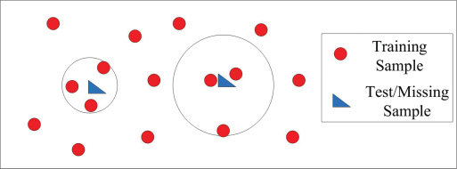

```{r include=FALSE}
library(dplyr)
library(survey)
library(here)
library(kableExtra)
```

# Técnicas para el tratamiento de la no respuesta en encuestas

<div align="center">


<h2>Maestría en generación y análisis de datos estadísticos</h2>
<h3>Investigación electoral y de Opinión Pública Aplicada I: clases 4 y 5</h3>
<h3>Lic. Luis Nahuel Fernández</h3>
<h4>2024</h4>

</div>

# Metodologías útiles para minimizar los efectos de la no respuesta.

Existen distintas técnicas que se utilizan para minimizar el impacto de la no respuesta en las estimaciones de una muestra:

- Eliminación de datos incompletos
- Pareo de observaciones
- Imputación de medias condicionadas o no condicionadas.
- Estimación por máxima verosimilitud
- Imputación.
- Reponderación o calibración
- Propensity score

## Eliminación de datos o *Listwise deletion*

Consiste en utilizar solo la información completa. **Esta metodología no es recomendable** ya que: 

"Al eliminar información se asume que la submuestra de datos excluidos tiene las mismas características que los datos completos, y que la falta de respuesta se generó de manera [completamente] aleatoria lo cual en la mayoría de las situaciones prácticas no se cumple.
Cuando los datos analizados provienen de una muestra probabilística, eliminar observaciones
no es correcto ya que se debe tener presente que las unidades fueron elegidas con un procedimiento
aleatorio y con probabilidad de selección, conocida y distinta de cero, que no puede ser ignorada en
el tratamiento de los datos ni en el cálculo de los estimadores y sus errores." 
(Medina y Galván, 2007: 22)

## Pareo de observaciones o *pairwise deletion*

Se excluyen solo los casos que no tienen respuesta a un par de variables determinados según cada caso de análisis.

**"bajo ninguna circunstancia se recomienda el uso de esta metodología"**
(Medina y Galván, 2007: 23)

## Imputación por medias

Consiste en imputar la media de determinada variable, condicionada o no. Es la forma más arcaica de impitación.
Tampoco es recomendable su utilización ya que altera significativamente la distribución de la variable en la que se utiiza disminuyendo su varianza. 
Puede ser un recurso útil solo en casos de una tasa de no respuesta muy baja o cuando el único parámetro de interes es la media de la variable a imputar.

## Estimación por máxima verosimilitud

- Asume que los datos faltantes siguen un patrón MAR
- Suele utilizar el algoritmo *espectation maximization (EM)*.
- Pretende a partir de la estimación de los parámetros de un modelo imputar valores en base a esos parámetros.
- En un trabajo realizado por P. T. Von Hippel, se realizaron críticas a la utilización de este algoritmo. Las mismas consisten en que al estimar los parámetros utilizando solo la información disponible tiende a reproducir los sesgos generados por la no respuesta, por otro lado al estar programado en distintas de sus versiones sin tener en cuenta el error tiene una propensión a alterar la distribución de la muestra. 

# Imputación

Consiste en asignar un valor válido a un dato faltante. Es una metodología muy útil ya que permite realizar estimaciones manteniendo la completitud de la muestra por lo que es utilizada en todos los institutos de estadística del mundo. 
Existe una gran cantidad de métodos para cumplir este objetivo, ya que a partir del el auge del aprendizaje automático, a los algoritmos tradicionales se sumaron una gran cantidad de nuevas variantes. Es importante conocer cada uno de ellos ya que, si bien son una herramienta muy útil, una selección equivocada del mecanismo de imputación puede tener consecuencias negativas. 

Algunos métodos son:

## Hot-deck: 

Su nombre proviene de cuando las encuestas se realizaban en papel y los datos se almacenaban en tarjetas. En caso de que hubiera datos faltantes en alguna de ellas, se imputaba tomando el valor faltante de otra tarjeta con valores similares en las otras variables del cuestionario. Se le asigna el calificativo de "caliente" ya que utiliza datos novedosos. Se usa en variables cualitativas y cuantitativas. Puede ser secuencial, aleatorio, jerárquico, ponderado y una amplia gama de variantes.

Supongamos que el registro ${Y_{i}}$ posee un valor missing. Este algoritmo busca un valor ${Y_{j}}$ tal que ${x_{i}}$=${x_{j}}$. Según si se utilice de manera secuencial o aleatoria puede o no ser determinístico.

## Cold-deck: 

Es como hot deck, pero utiliza datos preexistentes.

## KNN: 

Imputa por el entorno más próximo. Busca en un espacio multidimensional k cantidad de registros cercanos según una determinada medida de distancia (euclídea, Minkowski, Manhattan, etc). A partir de ellos imputa la media, la moda, el máximo, el mínimo o el valor que el usuario decida. Es útil con variables cualitativas y cuantitativas.




## Métodos más sofisticados

Existen una gran cantidad de métodos de mayor sofisticación que van desde la regresión lineal múltiple, pasando por árboles de decisión, ensambles de árboles, hasta modelos de redes neuronales.

## ¿Cómo evaluar si un módelo imputa correctamente?

Para evaluar si un módelo es útil en la imputación de una variable se pueden utilizar distintas métricas según la variable sea categórica o continua. Estas métricas suelen combinarse con validación cruzada.

- En variables categóricas se suele usar la curva ROC, el puntaje F1, la exactitud, la precisión, la especificidad y se suele graficar con la mátriz de confusión. Si bien estas suelen ser las más utilizadas, existen muchas otras.

- En variables numéricas se suele utilizar el error cuadrático medio, el error medio absoluto, el sesgo, etc. Sin embargo en determinados casos es fundamental analizar qué sucede con la distribución más allá de todas estas métricas.

La evaluación de un módelo es la parte más compleja de cualquier ejercicio de imputación.

# Reponderación

"Los ponderadores se interpretan como el número de unidades de la población que representa a cada elemento en la muestra, y es común que los algoritmos de reponderación se apliquen para compensar la falta de respuesta en subgrupos de interés.
Cuando en una subclase se detecta ausencia de información, los ponderadores de las unidades que sí respondieron se utilizan para ajustar los factores de expansión, de tal forma que la submuestra observada genere estimaciones compatibles con los valores poblaciones de la subclase de interés." (Medina y Galván, 2007:23)

La reponderación puede tomar distintas formas y tiende a utilizarse mayoritariamente para corregir la no respuesta total. Sin embargo también hay casos en los que se utiliza para corregir la no respuesta parcial, un ejemplo de ello son el ponderador de ingresos de la ocupación principal (PONDIO), el ponderador de ingresos individuales (PONDII) y ponderador de ingresos familiares (PONDIH) de la que son una reponderación del PONDERA original.

Veamos un ejemplo sencillo de cómo podría funcionar:

Supongamos que tenemos una muestra con 750 registros de tres estratos distintos. En el estrato 1 hay 250 casos con un ponderador de diseño que en promedio vale 40, en el estrato 2 hay otros 250 casos con un ponderador original que promedia 50 y en el estrato 3 hay otros 250 casos con un ponderador que promedia 100.

```{r ponde1}

data <- data.frame(
  id=1:750,
  estrato=c(rep(1, 250), rep(2, 250), rep(3, 250)),
  varNR=sample(c(1, 2, 3), size = 750, replace = TRUE)
)

data$ponderador[data$estrato==1]<-runif(250,30,50)
data$ponderador[data$estrato==2]<-runif(250,30,70)
data$ponderador[data$estrato==3]<-runif(250,80,120)

data %>% group_by(estrato) %>% summarise(registros=n(),
                                         poblacion=sum(ponderador))->pob

pob %>%
  kbl(caption = "Muestra ponderada por estrato") %>%
  kable_classic(full_width = F, html_font = "Cambria")


```

Pero en la variable de interés existe una no respuesta que se distribuye de manera desigual en cada estrato. En el estrato 1 hubo 20 no respuestas, en el 2 hubo 25 y en el 3 hubo 10.

```{r}
data$varNR[sample(1:250, 50)] <- NA
data$varNR[sample(251:500, 25)] <- NA
data$varNR[sample(501:750, 10)] <- NA

data %>% group_by(estrato) %>% summarise(poblacion=sum(ponderador),
                                         poblacionRepresentada=sum(ponderador[!is.na(varNR)]),
                                         ponderadorOrig=mean(ponderador),)->pob2

pob2 %>%
  kbl(caption = "Muestra ponderada por estrato y no respuesta") %>%
  kable_classic(full_width = F, html_font = "Cambria")
```
Para corregir la no respuesta puedo calcular un factor de expansión por estrato que será el cociente entre la población del estrato según el ponderador original y la población representada quitando la no respuesta. 

```{r}

pob2$factorE<-pob2$poblacion/pob2$poblacionRepresentada
pob2$ponderadorRepond<-pob2$ponderadorOrig*pob2$factorE

pob2%>%
  kbl(caption = "Reponderación de la muestra por estrato") %>%
  kable_classic(full_width = F, html_font = "Cambria")

```

Esta es la versión más simple de la reponderación.

## Posestratificación

La posestratificación es muy semejante a la versión previa de la reponderación, pero se caracteriza por la utilización de datos exógenos para el calculo del factor de expansión.

Para su aplicación debo tener una variable auxiliar ${X_{i}}$ categórica. Esta variable me permite dividir al universo U en pos estratos ${U_{1}}$, ${U_{2}}$, ..., ${U_{H}}$, de los cuales conocemos su tamaño ${N_{1}}$, ${N_{2}}$, ..., ${N_{H}}$.

Del universo U, tengo una muestra s con las siguientes caracteríctiscas:

- ${w_{i}}$ ponderadores originales
- ${\hat N_{h}}$ estimación del total de unidades en el posestrato h
- N total de unidades en el posestrato h
- ${fa_{h}}={N_{h}}/{\hat N_{h}}$ factor de ajuste en el posestrato h
- ${d_{hi}}={w_{hi}}.{fa_{h}}$ ponderadores posestratificados

De esta manera estimamos el total de ${Y_{i}}$ mediante

${\hat t_{yPS}} = \displaystyle \sum_{h} N_{h} . ({\hat t_{yh}/ \hat N_h)$

### Características que deben cumplirse

- Se sugiere un tamaño mínimo de muestra en cada posestrato de 24 registros
- Si los ${N_{H}}$ están mal medidos podemos empeorar las estimaciones
- Los posestratos no tienen por qué ser estratos de selección
- El buen funcionamiento de la posestratificación dependerá de la asociación entre ${X_{i}}$ e ${Y_{i}}$
- Puede aplicarse con varias variables mediante el producto cartesiano de todas ellas

### Posibles problemas

- Celdas muy pequeñas en cantidad de efectivos poblacionales
- Posestratos con muy pocos casos muestrales

Esto puede llevar a factores de expansión altos que aplicados al ponderador de diseño generen valores extremos en el ponderador reponderado afectando el coeficiente de variación de las estimaciones que se producen.

### Posible solución

Calibrar los ponderadores.

# Calibración

La calibración es una forma levemente más sofisticada de reponderación. Consiste en ajustar los ponderadores de diseño por los marginales de las proyecciones de población, en lugar de por el producto cartesiano.

Supongamos que tengo las variabes $X$ y $Z$ sobre las cuales pretendo calibrar los ponderadores.

$t{X_{1}}$, ..., $t{X_{N}}$, $t{Z_{1}}$, ..., $t{Z_{N}}$

Una forma 'casera' de hacerlo es en forma iterativa. El raking ratio fue uno de los primeros métodos de calibración (Deming-Stepahn, 1940).

Dado un diseño de muestra con factores de expansión ${d_i}$ y un vector de variables auxiliares $x$, buscamos nuevos factores de expansión $w$ tal que

${ \displaystyle \sum_{k∈s} w_k . x_k=t_x}$

¿Cómo estimar sin error el total de las variables auxiliares?

Los \{$w_i$\} se deben alejar lo menos posible de los \{$d_i$\} 

Para ello debemos resolver la ecuación previa minimizando la función

${ \displaystyle \sum_{k∈s} \frac{G_k(w_k,d_k)}{q_k}}$

Donde G mide la distancia entre $w_k$ y $d_k$ y $q_k$ > 0 , siendo 1/$q_k$ el peso que se le desea dar a la unidad k

Nota: G es positiva, derivable en a y estrictamente convexa y G(a,a)=0 factor de ajuste = $w_k$ / $d_k$

## Cuestiones a tener en cuenta

- Se puede elegir G de forma de acotar el rango de variación de los factores de ajuste
- En este último caso puede suceder que el algoritmo no converja
- Los paquetes dedicados a calibración tienen diversas opciones para tratar este último problema
- Hay algoritmos de calibración que obtienen un ajuste perfecto a los marginales pero no la acotación. Otros hacen lo contrario.
- Una sugerencia puede ser inspeccionar primero la diferencia (absoluta y porcentual) entre los marginales y las estimaciones de diseño. Esto se hace con el objetivo de evaluar si no es necesario reducir las variables de ajuste o colapsar categorías.

## Según la función G se obtienen diversos estimadores

- $G(a,b)=(a-b)^2/2b$ => GREG
- $G(a,b)=a . log(a/b)+b-a$ => Raking
- $G(a,b)=a . log(a/b)+(1-a) . log(\frac{1-a}{1-b})$ => Raking

Donde 
- a es la población estimada en la muestra
- b es la población objetivo esperada según los datos exógenos

## Control de los factores de ajuste

Luego de la calibración es conveniente graficar la distribución de los factores de ajuste y ponderaciones finales por estrato. Se pueden utiizar tanto boxplot como histograma. El objetivo es evaluar por un lado que se haya calibrado correctamente y por el otro la existencia o no de valores extremos en los ponderadores posteriores a la calibración.

## Ejemplo

Supongamos que realizamos una encuesta a personas de ambos sexos mayores de 64 años en la provincia de Córdoba. Y tenemos una muestra probabílistica compuesta por 200 respondentes en la ciudad de Río Cuarto, 1000 en el Grán Córdoba y 800 en el resto de la provincia. Sabemos que la cantidad de personas en esta franja etaria en toda la provincia es cercana a las 450.000 personas. Para identificar a los aglomerados se utilizaron las definiciones de los aglomerados de la EPH, pero para el interior de la provincia se utilizó el código 45. Sin embargo observamos que los ponderadores de diseño no representan correctamente los totales poblacionales que obtuvimos mediante la EPH.

**Aclaración importante**: en este caso para hacer más sencilla la simulación se generaron ponderadores de diseño de manera aleatoria con distribución normal. Teniendo un correcto trabajo en el diseño de la muestra la diferencia debería ser mucho menor. El objetivo del ejemplo es ejemplificar cómo funcionan la reponderación y la calibración. En todos los ejemplos de esta materia se soslayó el diseño de la muestra ya que dicho tema constituye una materia en sí misma y no es objetivo de esta clase

```{r}
# la base personas debe haber quedado de la clase anterior
Base.personas.EPH <- read.csv2(here("clase 3","ejercicio","EPH_usu_1er_Trim_2024_txt",
                                   "usu_individual_T124.txt"))


Base.personas.EPH %>% filter(AGLOMERADO %in% c(13,36))->cordoba
cordoba %>% filter(CH06>64)->cordoba
cordoba %>% group_by(CH04, AGLOMERADO) %>% summarise(b=sum(PONDERA))->totales

as.data.frame(t(c(1,45,97000)))->varInt
as.data.frame(t(c(2,45,138000)))->mujInt

names(varInt)<-names(totales)
names(mujInt)<-names(totales)

totales<-rbind(totales,varInt)
totales<-rbind(totales,mujInt)

data <- data.frame(
  id=1:2000,
  AGLOMERADO=c(rep(36, 200), rep(13, 1000), rep(45,800)),
  CH04=sample(c(1, 2), size = 2000, replace = TRUE),
  ponderador=rnorm(2000,225, 20)
  
)

data %>% group_by(AGLOMERADO, CH04) %>% summarise(a=sum(ponderador))->res
left_join(res, totales)->res

res %>%
  kbl(caption = "Población estimada y población objetivo en el ejemplo") %>%
  kable_classic(full_width = F, html_font = "Cambria")
```

Se observan diferencias importantes sobre todo en varones del Gran Córdoba y Río Cuarto, y entre las mujeres del resto de la provincia. Por lo que debemos calibrar.

### Código ejemplo logit

```{r}
  
disenios <- svydesign(id = ~id,
                        weights = data$ponderador,
                        nest = TRUE,
                        data = data)
  

totales %>% group_by(CH04) %>% summarise(Freq=sum(b))->tSexo
totales %>% group_by(AGLOMERADO) %>% summarise(Freq=sum(b))->tAglo
  
calibracion <- calibrate(disenios,
                           formula =list(~CH04,~AGLOMERADO) ,
                           list(tSexo, tAglo),
                           calfun = "logit",
                           bounds = c(0.33,3) # Estos son los limites que le pongo a la calibración
  )
  
data$calibracionLogit<-weights(calibracion)
  
data %>% group_by(AGLOMERADO,CH04) %>% summarise(logit=sum(calibracionLogit))->calLog
```

### Código ejemplo raking

```{r}
  
disenios <- svydesign(id = ~id,
                        weights = data$ponderador,
                        nest = TRUE,
                        data = data)
  

totales %>% group_by(CH04) %>% summarise(Freq=sum(b))->tSexo
totales %>% group_by(AGLOMERADO) %>% summarise(Freq=sum(b))->tAglo
  
calibracion <- calibrate(disenios,
                           formula =list(~CH04,~AGLOMERADO) ,
                           list(tSexo, tAglo),
                           calfun = "raking",
                           bounds = c(0.33,3) 
  )
  
data$calibracionRaking<-weights(calibracion)
  
data %>% group_by(AGLOMERADO,CH04) %>% summarise(RAK=sum(calibracionRaking))->calRak
```

### Código ejemplo pos estratificación

```{r}
  
res$factor<-res$b/res$a

res %>% select(AGLOMERADO, CH04,factor)->tablaExp
  
left_join(data,tablaExp)->data

data$calibracionPE<-data$ponderador*data$factor

data %>% group_by(AGLOMERADO,CH04) %>% summarise(PE=sum(calibracionPE))->calPE


```
## Análisis de los distintos ponderadores según fórmula de calibración o pos estratificación.

```{r}
res$factor<-NULL
left_join(res, calPE)->res
left_join(res, calRak)->res
left_join(res, calLog)->res

res %>%
  kbl(caption = "Población estimada según diseño y calibrada") %>%
  kable_classic(full_width = F, html_font = "Cambria")
```

### Distribución de los ponderadores

Ponderador de diseño:

```{r}
summary(data$ponderador)
```

Ponderador de PE:

```{r}
summary(data$calibracionPE)
```

Ponderador Logit:

```{r}
summary(data$calibracionLogit)
```


Ponderador Logit:

```{r}
summary(data$calibracionRaking)
```

Comparación:

Aclaración: está sin tildes porque la función devolvía error

```{r}
boxplot(data[, c("ponderador", "calibracionPE", "calibracionLogit", "calibracionRaking")],
        names = c("Disenio", "PE", "Logit", "Raking"),
        main = "Distribucion de ponderacion segun mecanismo de calibracion",
        xlab = "Metodo",
        ylab = "",
        col = c("lightblue", "lightgreen", "lightcoral", "lightgoldenrod"))
```


# Consignas TP clase 4

En esta carpeta se encuentra "baseBalotaje". Dicha base simula ser un relevamiento de opinión pública previo a un balotaje en la provincia de Santa Fé realizado en Rosario y la ciudad de Santa Fé de la Vera Crúz.
El objetivo de esta tarea es responder quién de los dos candidatos tiene más chances de ganar la elección en la provincia. Para poder responder a esta pregunta se debe en primer lugar analizar cuál es el patrón de la no respuesta. En segundo lugar, se deberá comparar tratamientos para la resolución de la misma. En el caso de calibrar se recomienda ajustar por sexo y grupo etario por separado para cada aglomerado. Una vez realizada la calibración es importante analizar qué sucede con los ponderadores, ¿Hay valores extremos? 

# Propensión de respuesta

- Es un derivado del propensity score matching
- El propensity score matching en su versión original **¡¡Asume que la selección no es aleatoria!!**

En este caso se asume aleatoriedad y para describir su utilización se utiliza como ejemplo la ENCoPraC 2022, la cual en su documento metodológico expresa:

"Ante la necesidad de dar una respuesta metodológica al problema de estimación bajo un contexto de no respuesta elevada, se llevó a cabo un procedimiento de ajuste bajo un enfoque experimental, y se debió incorporar un modelo de propensión de respuesta para los individuos seleccionados para generar un factor de ajuste por no respuesta en los factores de expansión de la encuesta.
El modelo asume como válido el supuesto de que el mecanismo de no respuesta desconocido asociado a la etapa de selección adicional impuesta por la ENCoPraC es aleatorio, y atribuye una probabilidad de respuesta fija a cada individuo seleccionado, y por lo tanto puede modelarse a partir de variables observadas. Esto significa que la propensión a responder de un individuo seleccionado en la cuarta etapa de selección, habiendo sido seleccionado previamente para participar de la EPH, depende de variables que son conocidas (y, por ende, observables) tanto para quienes respondieron como a quienes no lo hicieron. Estas variables corresponden a atributos de los in-
dividuos seleccionados, a características del hogar en el que habitan y a indicadores vinculados a los esfuerzos realizados por el equipo de relevamiento para intentar contactarlos.
En la práctica, la estimación de la propensión a responder de los individuos seleccionados para la ENCoPraC se llevó a cabo a partir de ajustar a los datos un modelo de regresion logit con base en un conjunto de variables disponibles de la encuesta. Este permite utilizar los valores estimados que surgen del ajuste para introducir la corrección por no respuesta en el factor de expansión inicial."

## Ejemplo

Supongamos que en el dataset que venimos trabajando tenemos una probabilidad de no respuesta a una determinada variable, que es el doble entre mujeres que entre varones pero con poca incidencia, es baja en Río Cuarto, media en el Gran Córdoba y alta en el resto de la provincia y tiene una gran correlación con el ingreso de la persona. 

De tal modo que la tasa de no respuesta es la siguiente:

```{r}
data$varNR=sample(c(1, 2, 3), size = 2000, replace = TRUE)
data$ingreso<-runif(2000,0,72)

data$probNR<-data$AGLOMERADO*5+data$CH04+data$ingreso*3-rnorm(2000,30,15)
summary(data$probNR)
data$varNR<-ifelse(data$probNR>runif(NROW(data),0,800),NA,data$varNR)
data$contesta<-ifelse(is.na(data$varNR),0,1)


data %>% group_by(AGLOMERADO, CH04) %>% summarise(tasaNr=sum(is.na(varNR))/n())->noResp

noResp %>%
  kbl(caption = "Tasa de no respuesta según aglomerado y sexo") %>%
  kable_classic(full_width = F, html_font = "Cambria")
```

Vamos a generar un propensity score para calcular la probabilidad de respuesta:

```{r}
data$AGLOMERADO<-as.factor(data$AGLOMERADO)
data$CH04<-as.factor(data$CH04)

modelo.logit<-glm(contesta ~ CH04 + AGLOMERADO + ingreso, data = data, family = "binomial")


```

Observamos los coeficientes del modelo:

```{r}
coef(modelo.logit)%>%
  kbl(caption = "Coeficientes del modelo") %>%
  kable_classic(full_width = F, html_font = "Cambria")
```

Generamos factores de expansión con la inversa de la probabilidad de respuesta, con ellos expandimos el ponderador calibrado con raking para los casos respondentes:

```{r}
data$probabilidad<-predict(modelo.logit, data, type="response")
data$factorPS<-1/data$probabilidad

data$pondPS<-ifelse(is.na(data$varNR),0, data$factorPS*data$calibracionRaking)

data %>% group_by(AGLOMERADO, CH04) %>% summarise(pondRaking=sum(calibracionRaking),
                                                  pondPS=sum(pondPS)) %>%
  kbl(caption = "Varones y mujeres por aglomerado con no respuesta ajustada por PS") %>%
  kable_classic(full_width = F, html_font = "Cambria")
```
Comparamos los ponderadores ajustados mediante propensity score con otros reponderados mediante pos estratiicación.

```{r}
data$pondiVarNR<-ifelse(is.na(data$varNR),0,data$calibracionRaking)
data %>% group_by(AGLOMERADO,CH04) %>% summarise(a=sum(pondiVarNR),
                                                 b=sum(calibracionPE))->calPE

calPE %>%
  kbl(caption = "Población estimada y población objetivo en el ejemplo 2") %>%
  kable_classic(full_width = F, html_font = "Cambria")

```
```{r}
calPE$factor2<-calPE$b/calPE$a

calPE %>% select(AGLOMERADO, CH04,factor2)->tablaExp
  
left_join(data,tablaExp)->data

data$pondiVarNR<-data$pondiVarNR*data$factor2

boxplot(data[, c("pondPS", "pondiVarNR")],
        names = c("PS", "PE"),
        main = "Comparacion propensity score con pos estratificación",
        xlab = "Metodo",
        ylab = "",
        col = c("lightblue", "lightgreen"))
```

```{r}
summary(data$pondPS)
```

```{r}
summary(data$pondiVarNR)
```

